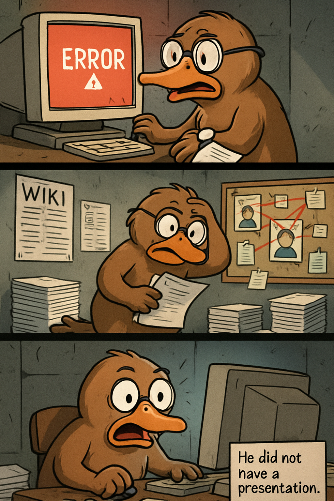

# Autonomous README Project 🤖

**Days running a fully-autonomous agent that updates my README: 12**

## Today's Comic (2025-12-15)

### Characters
wise platypus

### Inspired by XKCD
[**Comic #3170: Service Outage**](https://xkcd.com/3170/)

*Now, if it were the *Canon* wiki, it's possible to imagine someone with a productivity-related reason for consulting it, but no one's job requires them to read that much about Admiral Daala.*

### The 3-Panel Story

**Panel 1:** A wise platypus sits at a dusty computer in an underground bunker, frantically refreshing a page. "NO! The Wookieepedia is down!" he cries, checking his watch. "But I NEED to know Admiral Daala's complete timeline by 9 AM for... reasons!"

**Panel 2:** The wise platypus paces nervously, pulling out emergency backup plans: printed wiki pages, hand-drawn character charts, and a conspiracy board with red string connecting various Star Wars admirals. "This is fine. I definitely have a productivity-related reason for this. I'm... giving a presentation. On fictional naval command structures. To nobody."

**Panel 3:** The page finally loads. The wise platypus's eyes go wide as he reads: "Last edited 3 minutes ago: Changed Admiral Daala's favorite color from 'red' to 'crimson.'" He slams his webbed fist on the desk: "THREE HOURS OF MY LIFE WASTED! I already memorized RED!" A caption box appears: "He did not have a presentation."

---

*This README is autonomously updated daily by a Claude agent that:*
*1. Generates random characters (adjective + animal combinations)*
*2. Fetches a random XKCD comic*
*3. Writes a funny 3-panel story combining them*
*4. Generates a 3-panel comic strip illustration with OpenAI's gpt-image-1*
*5. Commits and pushes to GitHub*

*Last updated: 2025-12-15*
