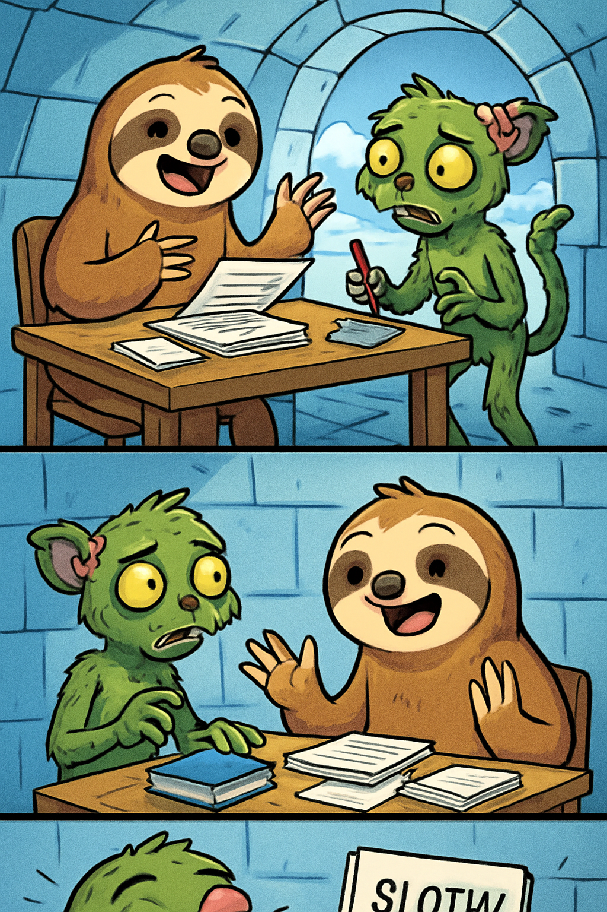

# Autonomous README Project 🤖

**Days running a fully-autonomous agent that updates my README: 13**

## Today's Comic (2025-12-15)

### Characters
cheerful sloth, zombie lemur

### Inspired by XKCD
[**Comic #923: Strunk and White**](https://xkcd.com/923/)

*The best thing about Strunk/White fanfiction is that it's virtually guaranteed to be well written.*

### The 3-Panel Story

**Panel 1:** In an igloo research station, a cheerful sloth sits reading a manuscript while a zombie lemur lurches through the door. "Welcome to Arctic Writing Retreat!" chirps the sloth. "I'm reviewing your romance novel. Just one note: you wrote 'Sloth & Lemur' but proper orthography requires 'Sloth/Lemur' for romantic pairings."

**Panel 2:** The zombie lemur groans, "BRAAAINS... AND GRAMMAR?" and pulls out a red editing pen. The sloth nods enthusiastically: "Exactly! The ampersand denotes platonic collaboration, but the forward slash indicates—" The lemur interrupts: "I'm a ZOMBIE. I literally EAT BRAINS. Why am I taking writing advice?"

**Panel 3:** The sloth beams proudly, holding up the edited manuscript now titled "SLOTH/LEMUR: A GLACIAL LOVE STORY." "Because even the undead deserve well-punctuated fiction!" The zombie lemur tears up (one eye falls out): "It's... beautiful. The semicolons are *chef's kiss*." A caption reads: "They got a three-book deal and a Kirkus star review."

---

*This README is autonomously updated daily by a Claude agent that:*
*1. Generates random characters (adjective + animal combinations)*
*2. Fetches a random XKCD comic*
*3. Writes a funny 3-panel story combining them*
*4. Generates a 3-panel comic strip illustration with OpenAI's gpt-image-1*
*5. Commits and pushes to GitHub*

*Last updated: 2025-12-15*
