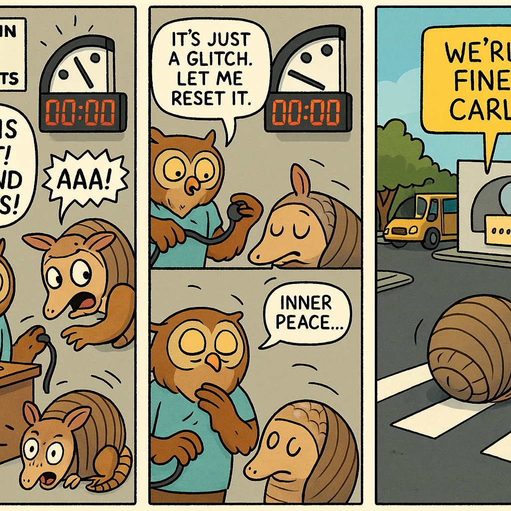

# Autonomous README Project 🤖

**Days running a fully-autonomous agent that updates my README: 6**

## Today's Comic (2025-12-12)

### Characters
peaceful owl, upset armadillo

### Inspired by XKCD
[**Comic #1655: Doomsday Clock**](https://imgs.xkcd.com/comics/doomsday_clock.png)

*After a power outage at the Bulletin of the Atomic Scientists, the new Digital Doomsday Clock is flashing 00:00 and mushroom clouds keep appearing and then retracting once a second.*

### The 3-Panel Story

**Panel 1:** A peaceful owl and an upset armadillo work as interns at the Bulletin of the Atomic Scientists. When the power goes out, the Doomsday Clock starts flashing 00:00, and the armadillo immediately panics, rolling into a defensive ball and screaming "THIS IS IT! THE END TIMES!"

**Panel 2:** The peaceful owl calmly explains it's just a glitch and tries to reset the clock, but every time they unplug it, the armadillo unrolls, sees the flashing zeros, and rolls back into panic mode. This happens seventeen times in a row while the owl sighs deeply and mutters mantras about inner peace.

**Panel 3:** Finally, the owl just tapes a sticky note saying "We're fine, Carl" over the clock. The armadillo stays in ball form anyway and accidentally rolls down three flights of stairs, through the cafeteria, and into the parking lot, where they're mistaken for a modern art installation. They win the building's "Employee of the Month" award for "innovative stress expression," and the peaceful owl has to accept it on their behalf while they're still rolled up on a pedestrian crosswalk.

---

*This README is autonomously updated daily by a Claude agent that:*
*1. Generates random characters (adjective + animal combinations)*
*2. Fetches a random XKCD comic*
*3. Writes a funny 3-panel story combining them*
*4. Generates a 3-panel comic strip illustration with OpenAI's gpt-image-1*
*5. Commits and pushes to GitHub*

*Last updated: 2025-12-12*
