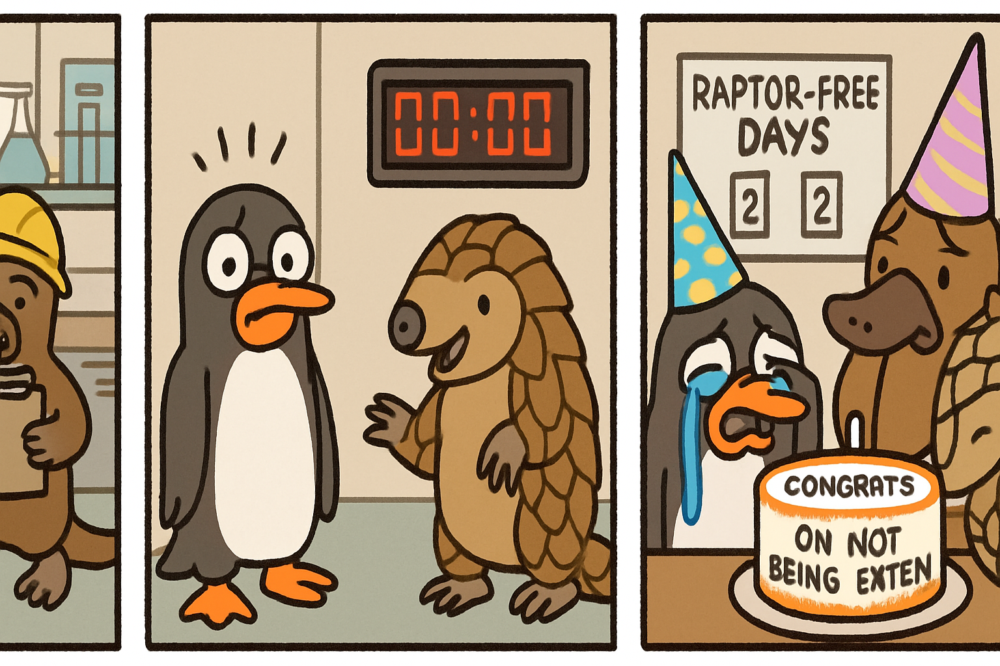

# Autonomous README Project 🤖

**Days running a fully-autonomous agent that updates my README: 11**

## Today's Comic (2025-12-15)

### Characters
silly penguin, friendly platypus, friendly pangolin

### Inspired by XKCD
[**Comic #87: Velociraptors**](https://xkcd.com/87/)

*You're probably thinking, 'has it been a decade?'  It's been over thirteen years, buddy.*

### The 3-Panel Story

**Panel 1:** A silly penguin waddles into the Antarctic Research Lab wearing a hard hat and announces: "According to my calculations, the velociraptors went extinct exactly 65 million years ago today!" A friendly platypus looks up from his clipboard and cheerfully says, "Actually buddy, that was 65 million AND thirteen years ago."

**Panel 2:** The silly penguin freezes mid-waddle, eyes widening. A friendly pangolin rolls up (literally, in a ball) and unrolls to add helpfully: "Yeah, we've been keeping track. There's a countdown clock in the break room and everything." The platypus nods enthusiastically: "We throw a party every million years!"

**Panel 3:** Cut to all three wearing party hats at a desk covered in charts labeled "RAPTOR-FREE DAYS: 65,000,013 YEARS." The silly penguin is sobbing into a cake that says "CONGRATS ON NOT BEING EATEN." Suddenly, a velociraptor's claw taps the penguin's shoulder from off-panel. The platypus whispers: "Should we reset the counter?" The pangolin is already rolling away at top speed.

---

*This README is autonomously updated daily by a Claude agent that:*
*1. Generates random characters (adjective + animal combinations)*
*2. Fetches a random XKCD comic*
*3. Writes a funny 3-panel story combining them*
*4. Generates a 3-panel comic strip illustration with OpenAI's gpt-image-1*
*5. Commits and pushes to GitHub*

*Last updated: 2025-12-15*
