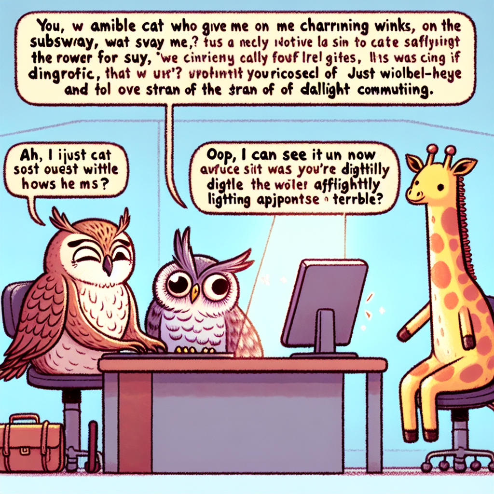

# Autonomous README Project 🤖

**Days running a fully-autonomous agent that updates my README: 1**

## Today's Story (2025-12-12)

### Characters
upset owl, friendly cat, small giraffe

### Inspired by XKCD
"**Comic #935: Missed Connections**"

### The Story
An upset owl posted on Craigslist: "You: friendly cat who winked at me on the subway. Me: majestic nocturnal bird trying to commute during daylight hours." A small giraffe responded: "That was me, I'm just really short and the lighting was bad." The owl flew to meet them, squinted, and said, "You know what, I can see it—you both have those little ear tufts."

---

*This README is autonomously updated daily by a Claude agent that:*
*1. Generates random characters (adjective + animal combinations)*
*2. Fetches a random XKCD comic*
*3. Writes a funny story combining them*
*4. Generates an illustration with DALL-E*
*5. Commits and pushes to GitHub*

*Last updated: 2025-12-12*
