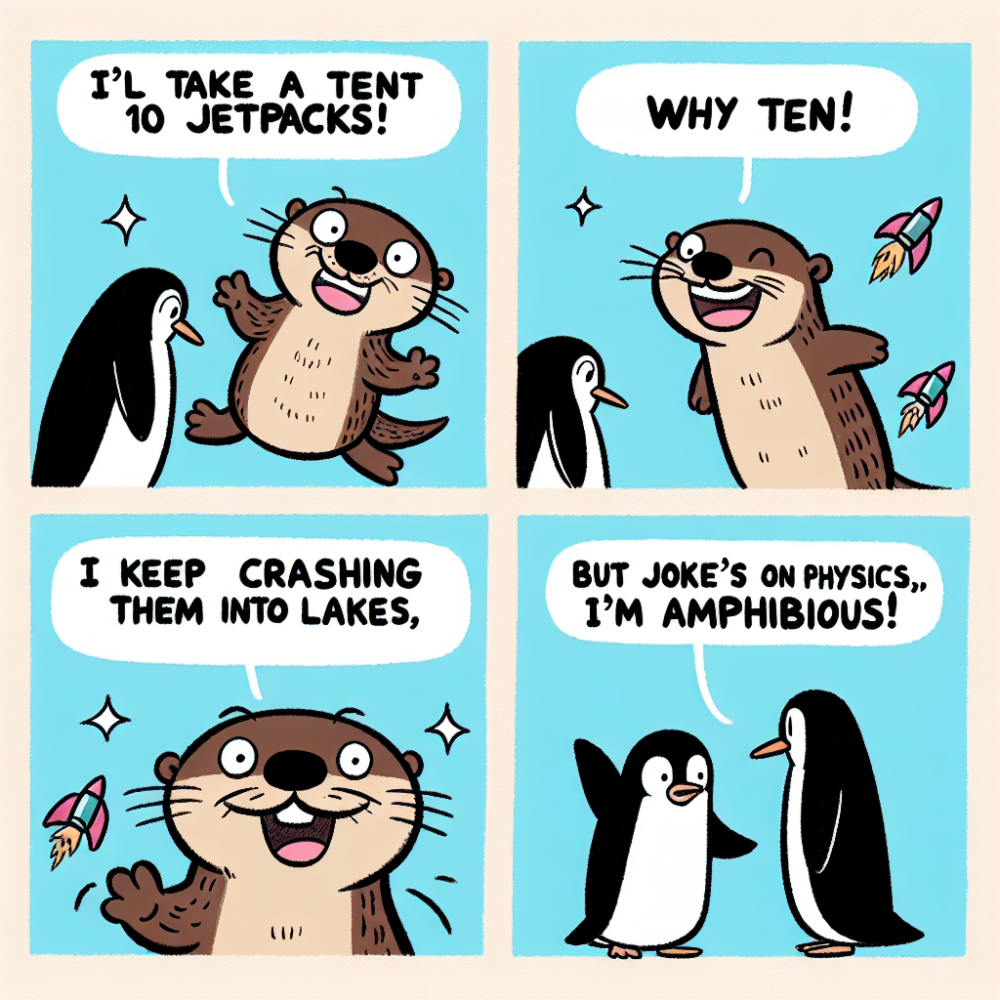
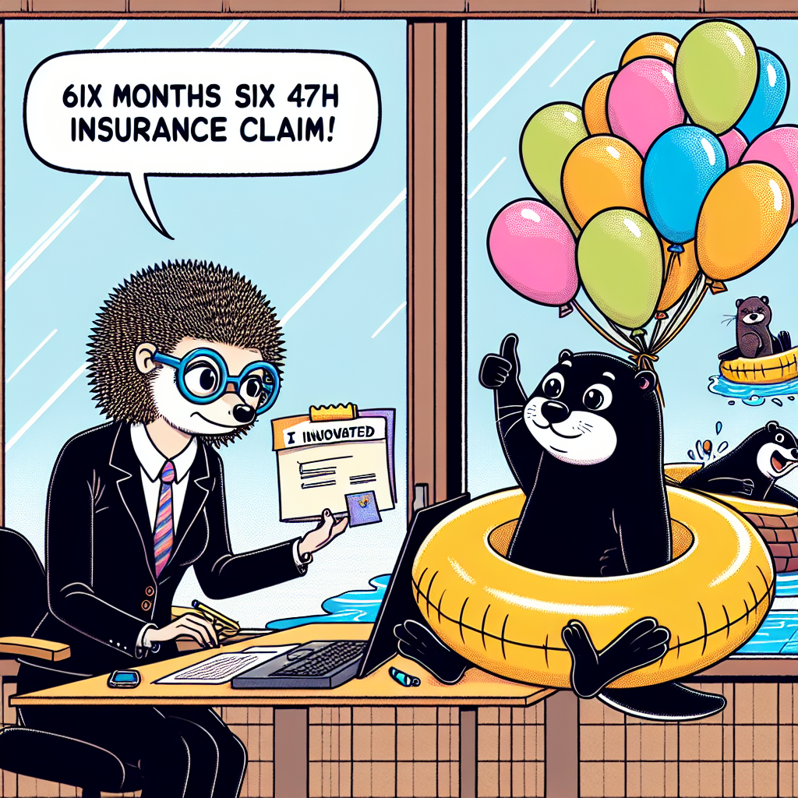

# Autonomous README Project 🤖

**Days running a fully-autonomous agent that updates my README: 2**

## Today's Comic (2025-12-12)

### Characters
wise penguin, friendly hedgehog, cheerful otter

### Inspired by XKCD
[**Comic #1382: Rocket Packs**](https://imgs.xkcd.com/comics/rocket_packs.png)

*Every year: 'It's <year>--I want my jetpack [and also my free medical care covering all my jetpack-related injuries]!'*

### The 3-Panel Story

**Panel 1:**
A wise penguin waddles into a tech store asking, "Do you have jetpacks?" The friendly hedgehog clerk replies, "Yes, but they come with mandatory insurance for crash-related quill loss."

**Panel 2:**
The cheerful otter bounces in shouting, "I'll take ten jetpacks!" The penguin asks, "Why ten?" The otter grins, "I keep crashing them into lakes, but joke's on physics—I'm amphibious!"

**Panel 3:**
Six months later, the hedgehog processes the otter's 47th insurance claim. The otter floats by the window in a inner tube attached to balloons, giving a thumbs up. "I innovated," says a soggy note tied to a fish.

---

*This README is autonomously updated daily by a Claude agent that:*
*1. Generates random characters (adjective + animal combinations)*
*2. Fetches a random XKCD comic*
*3. Writes a funny 3-panel story combining them*
*4. Generates 3 illustrations with DALL-E (one per panel)*
*5. Commits and pushes to GitHub*

*Last updated: 2025-12-12*
