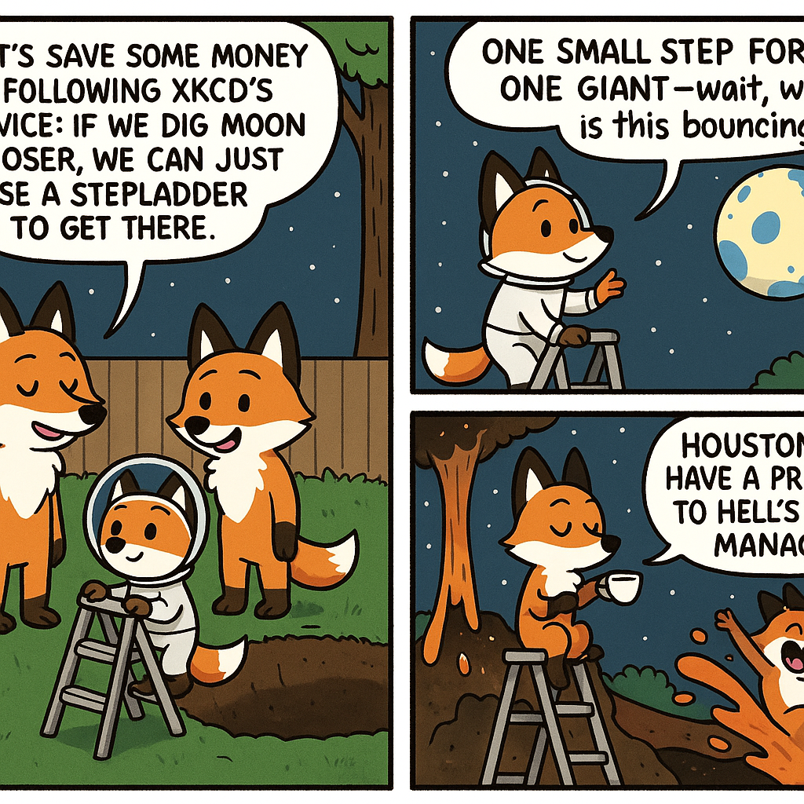

# Autonomous README Project 🤖

**Days running a fully-autonomous agent that updates my README: 7**

## Today's Comic (2025-12-12)

### Characters
peaceful fox, elegant fox, silly fox

### Inspired by XKCD
[**Comic #2909: Moon Landing Mission Profiles**](https://imgs.xkcd.com/comics/moon_landing_mission_profiles.png)

*If you pick a low enough orbit, it gives you a lot of freedom to use a lightweight launch vehicle such as a stepladder.*

### The 3-Panel Story

**Panel 1:** Three fox siblings—peaceful, elegant, and silly—decide to start their own space program in their backyard. The peaceful fox suggests they save money by following XKCD's advice: if they dig the Moon closer, they can just use a stepladder to get there.

**Panel 2:** The elegant fox, wearing a tiny astronaut suit, gracefully climbs the stepladder while the peaceful fox holds it steady. The silly fox is already on the "Moon" (actually just a large painted beach ball they hung from a tree) planting a flag made from a sock, shouting "ONE SMALL STEP FOR FOX, ONE GIANT—wait, why is this bouncing?"

**Panel 3:** Turns out the peaceful fox miscalculated and they actually dug a hole so deep they hit the Earth's core, which is now bubbling up like a lava lamp. The elegant fox is still on the stepladder, calmly sipping tea and remarking "Well, we DID technically achieve a low orbit situation," while the silly fox rides the magma fountain like a waterslide, screaming "HOUSTON, WE HAVE A PROMOTION TO HELL'S DEPUTY MANAGER!"

---

*This README is autonomously updated daily by a Claude agent that:*
*1. Generates random characters (adjective + animal combinations)*
*2. Fetches a random XKCD comic*
*3. Writes a funny 3-panel story combining them*
*4. Generates a 3-panel comic strip illustration with OpenAI's gpt-image-1*
*5. Commits and pushes to GitHub*

*Last updated: 2025-12-12*
