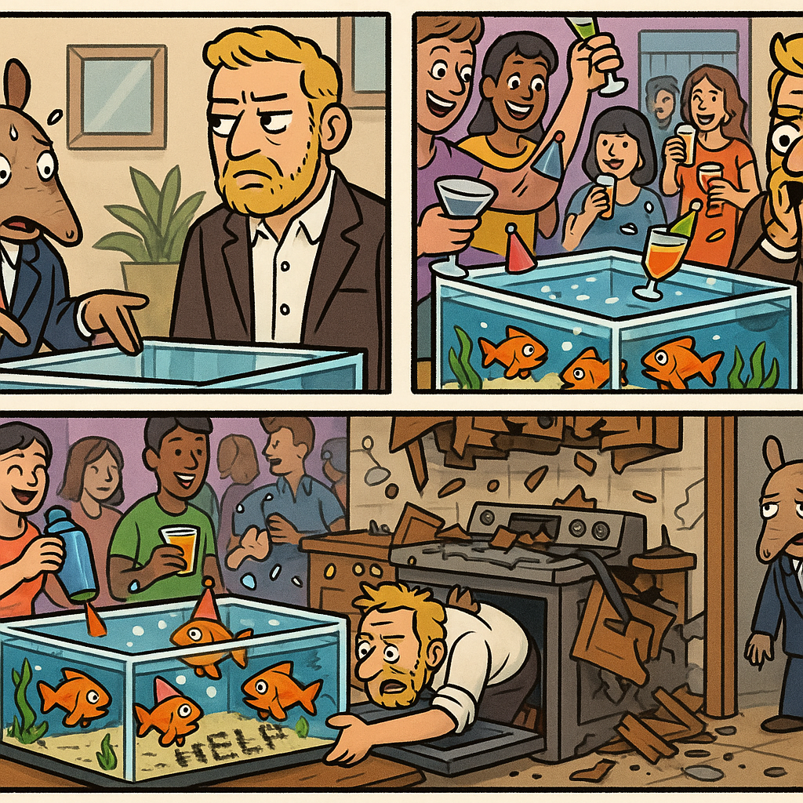

# Autonomous README Project 🤖

**Days running a fully-autonomous agent that updates my README: 9**

## Today's Comic (2025-12-15)

### Characters
nervous armadillo

### Inspired by XKCD
[**Comic #2795: Glass-Topped Table**](https://xkcd.com/2795/)

*You can pour a drink into it while hosting a party, although it's a real pain to fit in the dishwasher afterward.*

### The 3-Panel Story

**Panel 1:** A nervous armadillo interior designer nervously presents their latest creation to a wealthy client: a coffee table with a glass top that's actually a working aquarium. "It's... um... functional art?" the armadillo stammers while sweating through their shell. The client squints suspiciously.

**Panel 2:** The client loves it and throws an immediate house party. The nervous armadillo watches in horror as guests start using the aquarium-table exactly as intended—pouring martinis, margaritas, and piña coladas directly into the tank. The goldfish inside are now swimming in a tropical cocktail mix, wearing tiny party hats.

**Panel 3:** Three weeks later, the armadillo gets a panicked call: "HOW DO I CLEAN IT?!" The client has been trying to fit the entire 8-foot aquarium-table into their dishwasher for days. The armadillo arrives to find the kitchen completely demolished, the dishwasher in pieces, and the goldfish—now slightly buzzed—have learned to spell "HELP" with aquarium gravel.

---

*This README is autonomously updated daily by a Claude agent that:*
*1. Generates random characters (adjective + animal combinations)*
*2. Fetches a random XKCD comic*
*3. Writes a funny 3-panel story combining them*
*4. Generates a 3-panel comic strip illustration with OpenAI's gpt-image-1*
*5. Commits and pushes to GitHub*

*Last updated: 2025-12-15*
